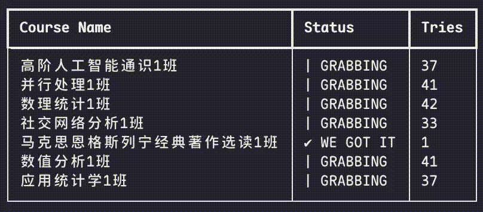
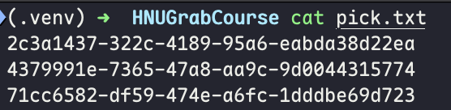

# HNUGrabCourse

> Every kind passerby can leave an apple here for HOLO.

## Introduction

This project is designed for our graduates of Hunan University to pick their courses that are needed to be done in "one year" :)

## Environment

- Python 3.12+
- Node.js 22+

## Usage

Create a virtual environment or just use the real environment, do `pip install -r requirements.txt`.

Execute `python holo.py` at the root directory of the project.

Then just login, and if everything gets right, you will see a file called "courses.json" in the root directory.

Pick some courses you want, then put their ids into the "pick.txt" at the root directory.

Like this:

Then press "ENTER" to proceed, and HOLO will do everything next.

JUST HAVE FUN! If you like this project, considering giving it a star 🌟 (PS: I'm going to use stars to buy apples for holo).

## Configuration

If you wanna control some specific actions, you may need to modify the config.json, it stores at `./config/config.json`.

- `courseFile`: stores all the courses that you need to grab
- `timeInterval`: the time interval every request takes, for friendly use, it was set to 300ms by default.